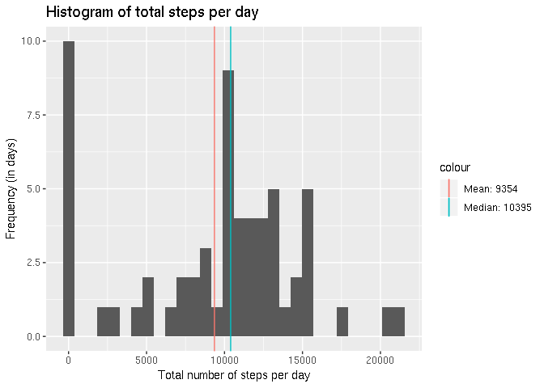
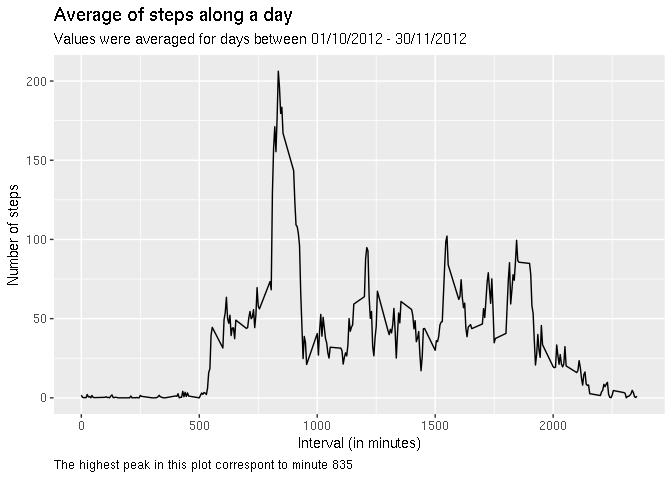
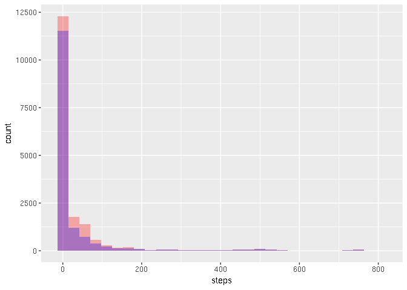
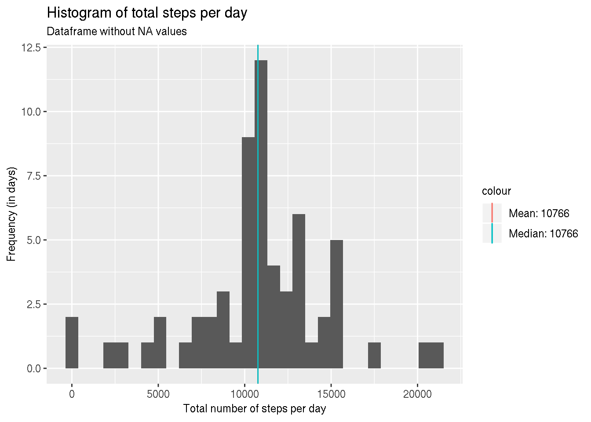
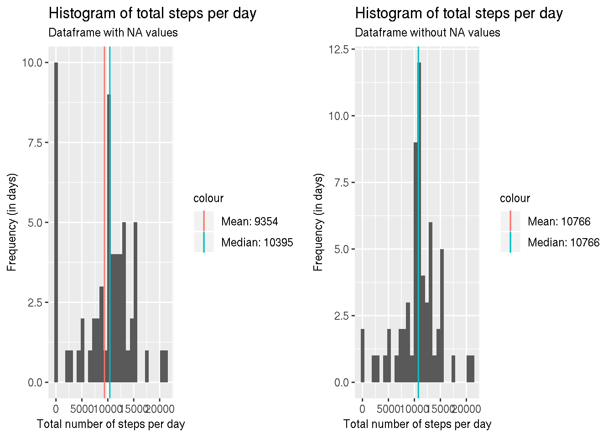
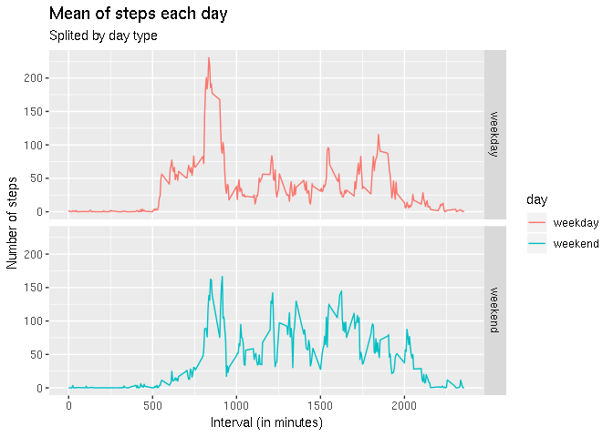
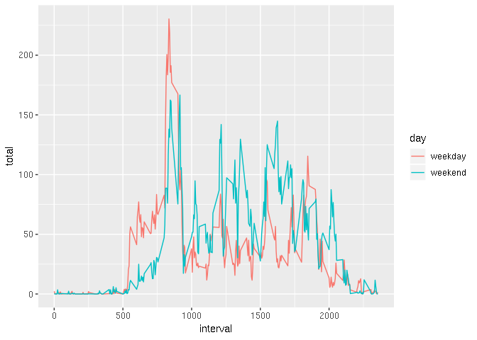

### Setup Rmarkdown file

```r
knitr::opts_chunk$set(echo = TRUE, message = FALSE, warning = FALSE, cache = TRUE)
```

## Loading and preprocessing the data

```r
library(tidyverse)
library(gridExtra)
df <- read_csv("./data/activity.csv")
```


## What is mean total number of steps taken per day?


```r
steps <- df %>% group_by(date)
steps_per_day_total <- steps %>%
                       summarise(total = sum(steps, na.rm = T))
steps_per_day_mean <- steps_per_day_total %>%
                       summarise(total = mean(total, na.rm = T))
steps_per_day_median <- steps_per_day_total %>%
                       summarise(total = median(total, na.rm = T))

hist_steps_total <- ggplot(steps_per_day_total) +
                    geom_histogram(aes(total))

plot1 <- hist_steps_total +
         geom_vline(aes(xintercept = steps_per_day_mean$total, color = "blue")) +
         geom_vline(aes(xintercept = steps_per_day_median$total, color = "red")) +
         scale_color_hue(labels = c(
             glue::glue("Mean: {round(steps_per_day_mean$total)}"),
             glue::glue("Median: {round(steps_per_day_median$total)}"))) + 
         labs(title = glue::glue("Histogram of total steps per day\n")) +
         xlab("Total number of steps per day") +
         ylab("Frequency (in days)")
print(plot1)
```

<!-- -->

As you can see in the plot, the mean is roughly 9354 and the median is 10395.


## What is the average daily activity pattern?


```r
steps_all_mean <- steps %>%
                  group_by(interval) %>%
                  summarise(mean = mean(steps, na.rm = T))

steps_all_mean_max <- steps_all_mean %>% filter(mean == max(mean))

steps_all_mean_plot <- ggplot(steps_all_mean) +
                       geom_line(aes(interval, mean)) +
                       labs(title = "Average of steps along a day",
                            subtitle = "Values were averaged for days between 01/10/2012 - 30/11/2012",
                            x = "Interval (in minutes)",
                            y = "Number of steps",
                            caption = glue::glue(
                                "The highest peak in this plot correspont to minute {steps_all_mean_max$interval}")) +
                        theme(plot.caption = element_text(hjust = 0))


print(steps_all_mean_plot)
```

<!-- -->


## Imputing missing values

Looking at the data, we can see we have some days containing `NA`s in the `steps` column.
Here are all the days that contain `NA`s:


```r
days_with_nas <- steps %>% filter(is.na(steps)) %>%
          group_by(date) %>%
          summarise("Number of NAs" = sum(is.na(steps)))

total_nas <- sum(days_with_nas[["Number of NAs"]])
days_with_nas
```

```
## # A tibble: 8 x 2
##   date       `Number of NAs`
##   <date>               <int>
## 1 2012-10-01             288
## 2 2012-10-08             288
## 3 2012-11-01             288
## 4 2012-11-04             288
## 5 2012-11-09             288
## 6 2012-11-10             288
## 7 2012-11-14             288
## 8 2012-11-30             288
```

```r
total_nas
```

```
## [1] 2304
```

As you can see, if we sum all the NAs in this tibble, we get 2304. Therefore, our dataframe contain 2304 `NA`s in it.

NA values sometimes end up getting in our way, so we could remove them.

I opted to change NAs with the mean for it's interval time.


```r
steps_interval_mean <- steps %>%
                       group_by(interval) %>%
                       summarise(mean = mean(steps, na.rm = T))

steps_no_nas <- steps %>%
     group_by(interval) %>%
     mutate(st = mean(steps, na.rm = T)) %>%
     filter(is.na(steps)) %>%
     mutate(steps = st) %>%
     select(-"st") 

steps_no_nas <- replace(steps, is.na(steps), steps_no_nas$steps)
steps_no_nas
```

```
## # A tibble: 17,568 x 3
## # Groups:   date [61]
##     steps date       interval
##     <dbl> <date>        <dbl>
##  1 1.72   2012-10-01        0
##  2 0.340  2012-10-01        5
##  3 0.132  2012-10-01       10
##  4 0.151  2012-10-01       15
##  5 0.0755 2012-10-01       20
##  6 2.09   2012-10-01       25
##  7 0.528  2012-10-01       30
##  8 0.868  2012-10-01       35
##  9 0      2012-10-01       40
## 10 1.47   2012-10-01       45
## # … with 17,558 more rows
```

```r
ggplot() +
    geom_histogram(data = steps_no_nas, aes(steps), fill = "red", alpha = 0.3) +
    geom_histogram(data = steps, aes(steps), fill = "blue", alpha = 0.3) 
```

<!-- -->

In the above plot, in red we see the histogram for the new dataframe (with `NA`s removed) and in blue we see the old dataframe
The histogram for the new dataset show a increase in the number of days with steps ranging from 0 to 150, approximately.


Ploting the histogram for this new dataset, showing the mean and median we get:


```r
steps_per_day_non_nas_total <- steps_no_nas %>%
                       summarise(total = sum(steps, na.rm = T))
steps_per_day_non_nas_mean <- steps_per_day_non_nas_total %>%
                       summarise(total = mean(total, na.rm = T))
steps_per_day_non_nas_median <- steps_per_day_non_nas_total %>%
                       summarise(total = median(total, na.rm = T))

hist_steps_total <- ggplot(steps_per_day_non_nas_total) +
                    geom_histogram(aes(total))

plot1_tmp <- plot1 + labs(subtitle = "Dataframe with NA values")
plot2 <- hist_steps_total +
         geom_vline(aes(xintercept = steps_per_day_non_nas_mean$total, color = "blue")) +
         geom_vline(aes(xintercept = steps_per_day_non_nas_median$total, color = "red")) +
         scale_color_hue(labels = c(
             glue::glue("Mean: {round(steps_per_day_non_nas_mean$total)}"),
             glue::glue("Median: {round(steps_per_day_non_nas_median$total)}"))) + 
         labs(title = glue::glue("Histogram of total steps per day\n"),
              subtitle = "Dataframe without NA values") +
         xlab("Total number of steps per day") +
         ylab("Frequency (in days)")
print(plot2)
```



```r
grid.arrange(plot1_tmp, plot2, ncol=2)
```



As we can see comparing the old and new dataframes, we reduced the days with `0` steps (`NA`s were treated as zeros in the previous histogram). Also, the median and mean increased, but this change wasn't so drastic.


## Are there differences in activity patterns between weekdays and weekends?


```r
weekday_end <- weekdays(steps_no_nas$date) %in% c("Sunday", "Saturday") %>% ifelse("weekend", "weekday")
steps_weekday_end <- steps_no_nas %>%
    ungroup() %>%
    mutate(day = factor(weekday_end)) %>%
    group_by(interval, day) %>%
    summarise(total = mean(steps))

ggplot(steps_weekday_end, aes(interval, total, color = day)) +
    geom_line() +
    facet_grid(day ~ .) +
    labs(title = "Mean of steps each day",
         subtitle = "Splited by day type",
         x = "Interval (in minutes)",
         y = "Number of steps")
```

<!-- -->

```r
ggplot(steps_weekday_end, aes(interval, total, color = day)) +
    geom_line()
```

<!-- -->

As we can see by this two plots, there is some different patterns in movement between weekdays and weekends.
